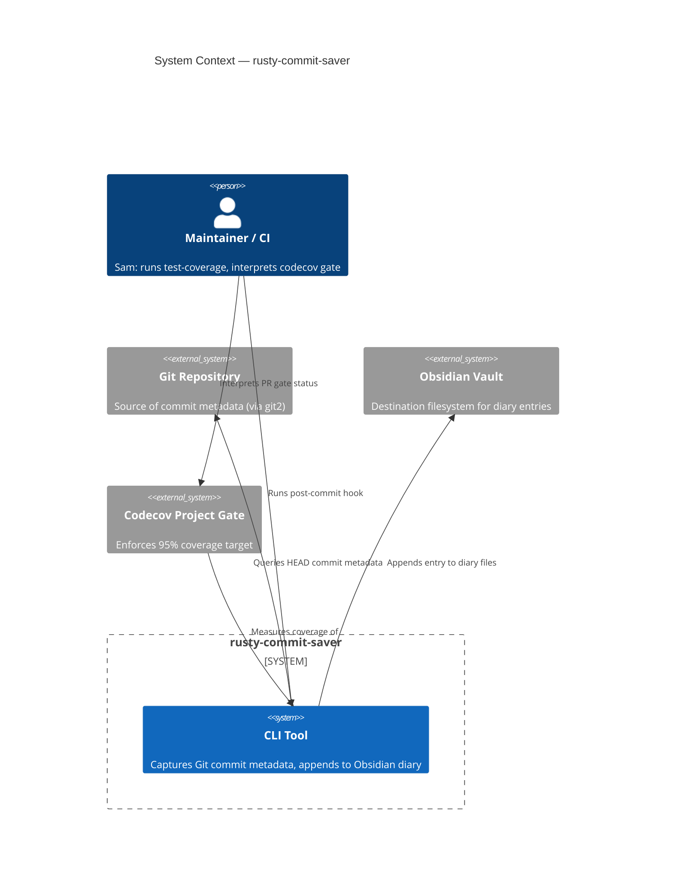
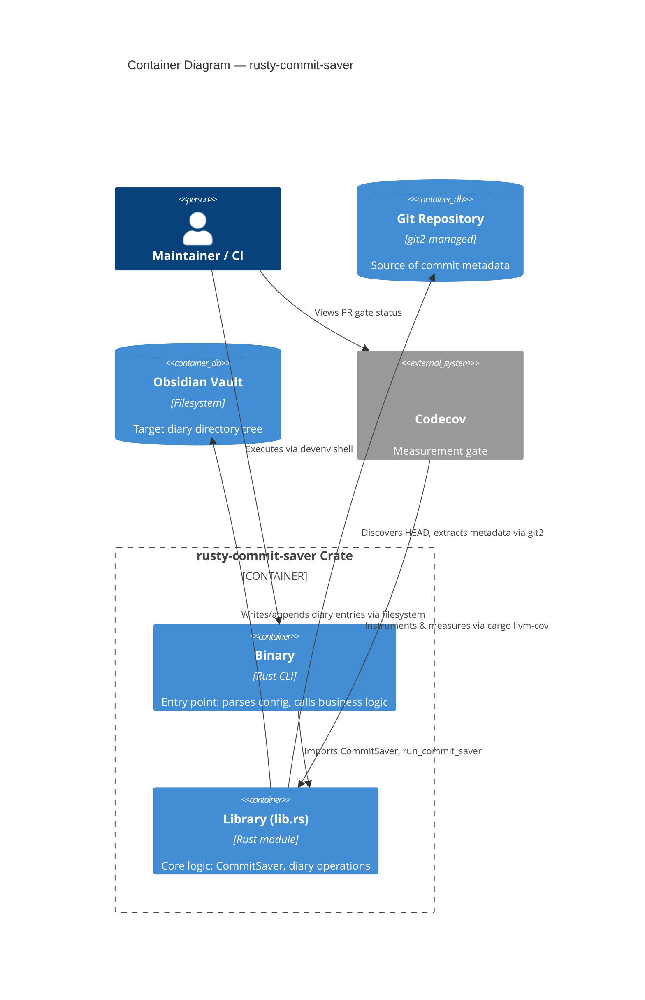

# Architecture Brief — rusty-commit-saver

> Application-level architecture for the Obsidian diary commit logger. DESIGN wave output.
> Density: **lean** (Tier-1 [REF] sections).

## System Context (C4 Level 1)

## Container Architecture (C4 Level 2)

## Application Architecture

### Structural Decision: Library/Binary Unification (ADR-001)

**Status:** ACCEPTED (DESIGN wave, 2026-06-20)

The binary (`src/main.rs`) was re-declaring `pub mod vim_commit` and `pub mod config` instead of importing them from the library crate. This caused **dual compilation**:
- One instrumented copy (tested)
- One dead copy in the binary (untested, ignored by codecov)

Coverage measurement averaged both copies, reporting `vim_commit.rs` at ~44% despite every line executing in the tested copy.

**Decision:** Convert the binary into a **thin CLI driving adapter** over the library core.

**Mechanics:**
1. `main.rs` drops `pub mod vim_commit; pub mod config;`
2. `main.rs` imports instead: `use rusty_commit_saver::{vim_commit::…, config::…, run_commit_saver}`
3. `run_commit_saver()` (business logic orchestrator) remains in `lib.rs` as a public function; `main()` calls it
4. `main()` retains only CLI initialization (env_logger, GlobalVars parsing, error logging)

**Result:**
- Single instrumented compilation per module
- Existing tests measure one copy only
- Coverage % reflects reality (no dead-code averaging)
- Aligns with hexagonal architecture: library is pure core, binary is driven adapter (CLI)

**Trade-offs & Alternatives:** See ADR-001 in `docs/product/architecture/adr-001-lib-bin-unification.md`.

### Component Decomposition

| Component | File(s) | Responsibility | Change Type |
|-----------|---------|-----------------|------------|
| **CommitSaver** (struct + methods) | `src/vim_commit.rs` | Captures Git HEAD metadata; orchestrates diary append | EXTEND (no changes in DESIGN; tests added DISTILL) |
| **Diary Operations** (fs helpers) | `src/vim_commit.rs` | create_diary_file, append_entry_to_diary, path checks | EXTEND |
| **Config Management** | `src/config.rs` | Parses INI file; manages global config state | EXTEND |
| **Binary Entry Point** | `src/main.rs` | CLI initialization, config setup, run_commit_saver call | EXTEND (refactor: drop module re-decls, import from lib) |
| **Library Re-export** | `src/lib.rs` | Public API: CommitSaver, run_commit_saver, helpers | EXTEND (no changes; already exposes all) |

**Reuse Analysis Table:** All components are EXTEND (consume existing, no NEW). The only refactor is removing duplication in `main.rs` (REMOVE-DUPLICATION subtype of EXTEND).

### Driving Ports (Inbound / Primary Adapters)

| Port | Role | Observable Signal | Adapter |
|------|------|------------------|---------|
| `devenv shell -- test-coverage` | Coverage measurement (CI-matching) | Printed per-file %; function-records | `cargo llvm-cov` + nextest |
| `devenv shell -- coverage-check` | Local coverage check before PR | PASS/FAIL vs 95% threshold | `cargo llvm-cov` (local) |
| codecov **project gate** | Release gate on PR | PR status: PASS/FAIL | Codecov enforcement (`.codecov.yml` target 95%) |
| `devenv shell -- cargo test` | Parallel test suite | Green/red | cargo test runner |
| `devenv shell -- lint` | Static analysis | Clean/warnings | clippy 1.97 |
| `devenv shell -- build-release` | Release binary build | Success/failure | cargo release build |

No new driving ports introduced. This is a measurement + test infrastructure feature (DISCUSS scope: infrastructure-only).

### Driven Ports (Outbound / Secondary Adapters)

| Port | Responsibility | Adapter | Technology |
|------|-----------------|---------|-----------|
| **Git Discovery** | Query HEAD commit metadata | `git2::Repository` | git2 v0.21.0 |
| **Obsidian Write** | Append entry to diary files | Rust `std::fs` | Filesystem (sync write) |
| **Config Read** | Load INI configuration | `configparser` + `once_cell` | INI file at `~/.config/rusty-commit-saver/rusty-commit-saver.ini` |

### Technology Stack

| Layer | Technology | Version | Rationale |
|-------|-----------|---------|-----------|
| **Runtime** | Rust | 1.97 (via devenv) | Language choice; type safety, zero-cost abstractions |
| **Git Integration** | git2 | 0.21.0 | Pure Rust bindings; no external git binary required; libgit2-sys |
| **DateTime** | chrono | 0.4.44 | Standard time/date handling; timezone-aware; format specs |
| **Config** | configparser | 3.1.0 | INI file parsing; minimal, OSS (MIT) |
| **CLI** | clap | 4.6.1 | Derive macro CLI builder; future-proof for extensions |
| **Logging** | log + env_logger | 0.4.31 + 0.11.10 | Standard Rust logging; zero-cost at build time |
| **Paths** | dirs | 6.0.0 | XDG-compliant home dir resolution; cross-platform |
| **Testing** | tempfile | 3.27.0 (dev-dep) | Fault injection via temp directories; no process CWD mutation |
| **Coverage** | cargo llvm-cov + nextest | (devenv) | LLVM-instrumented coverage; parallel test execution |

**OSS First:** All selections are open-source. No proprietary dependencies.

### Integration Patterns

**Synchronous/Direct:**
- Binary → Library function calls (in-process)
- Library → git2 (blocking sync calls, bounded by repo size)
- Library → filesystem (blocking sync writes, local disk latency)
- Library → configparser (one-time sync read at startup)

**Error Handling:**
- `Result<T, Box<dyn Error>>` throughout (trait objects for heterogeneous errors)
- Error propagation via `?` operator; no panic on recoverable faults
- `CommitSaver::from_repo()` handles no-HEAD, detached-HEAD, timestamp-out-of-range
- Diary operations catch IO errors (permission denied, disk full, invalid path)
- Main logs errors; process exits with error code

**Fault Tolerance:**
- Repository discovery (git2) returns `Err` if not in a git repo → propagated to main
- Diary write failures don't corrupt existing entries (append-only semantics)
- Path creation idempotent (fs::create_dir_all handles pre-existing dirs)

### Quality Attribute Strategies

| Attribute | Current Target | Strategy |
|-----------|---------------|---------|
| **Testability** | ≥95% line coverage (vim_commit.rs) | Dependency injection (CommitSaver::from_repo accepts &Repository); no process CWD coupling; tempfile fault injection |
| **Reliability** | No silent errors | Result-based error propagation; main() logs all Err; no panic on recoverable faults |
| **Maintainability** | Single-responsibility per function | Clear module boundaries (vim_commit = core logic; config = setup); unification removes duplication |
| **Correctness** | Diary format consistency | Markdown table escaping (pipes) implemented in CommitSaver; frontmatter boilerplate in create_diary_file |

### Deployment Architecture

**Binary Distribution:** Single-file Rust binary (post-compile).

**Installation:** Via `devenv shell -- build-release` → executable in `target/release/rusty-commit-saver`.

**Invocation:** Post-commit hook or manual CLI (no distribution mechanism in scope for DESIGN).

**Configuration:** INI file at `~/.config/rusty-commit-saver/rusty-commit-saver.ini` (user-writable, created on first run if missing).

**Observability:** Structured logging via `log` crate; log level controlled by `RUST_LOG` env var (e.g., `RUST_LOG=info`).

### Development Paradigm

**Language:** Rust (multi-paradigm capable)

**This Codebase Style:** Imperative / struct-based (OOP-like)
- `CommitSaver` is an aggregate struct with methods
- Immutable-by-default philosophy (minimal internal mutation via &mut)
- No trait-heavy abstraction (straightforward function signatures)

**Recommendation for Crafters:** **OOP/imperative** (match codebase style). No functional transformation or trait composition needed for current scope.

---

## References

- **DISCUSS artifacts:** `docs/feature/vim-commit-coverage/feature-delta.md` (US-01..04)
- **ADRs:** `docs/product/architecture/adr-001-lib-bin-unification.md`
- **Code:** `src/lib.rs` (public API), `src/main.rs` (CLI entry point post-refactor), `src/vim_commit.rs` (core logic), `src/config.rs` (configuration)
